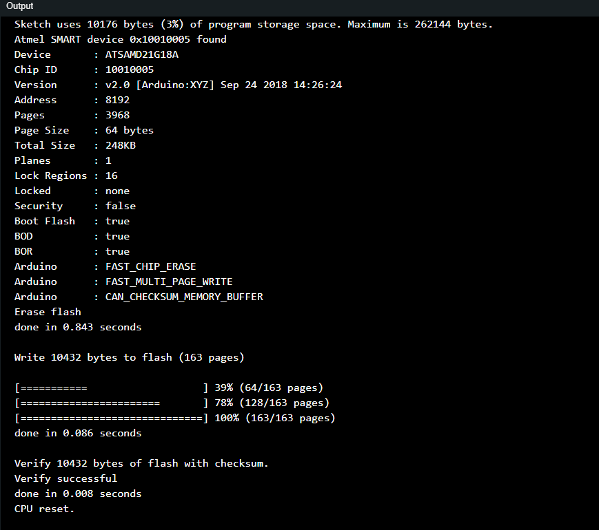
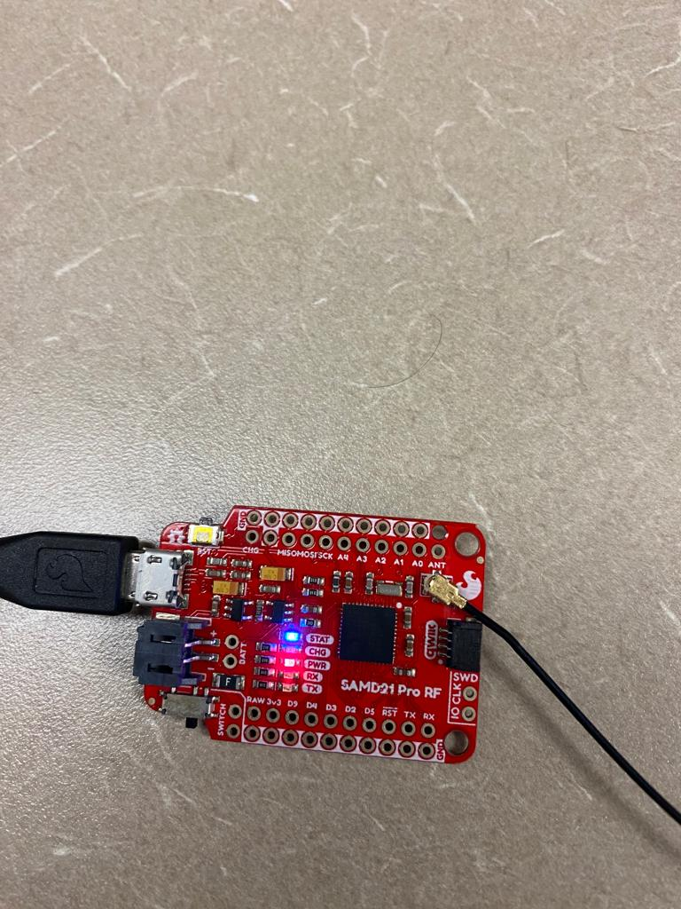
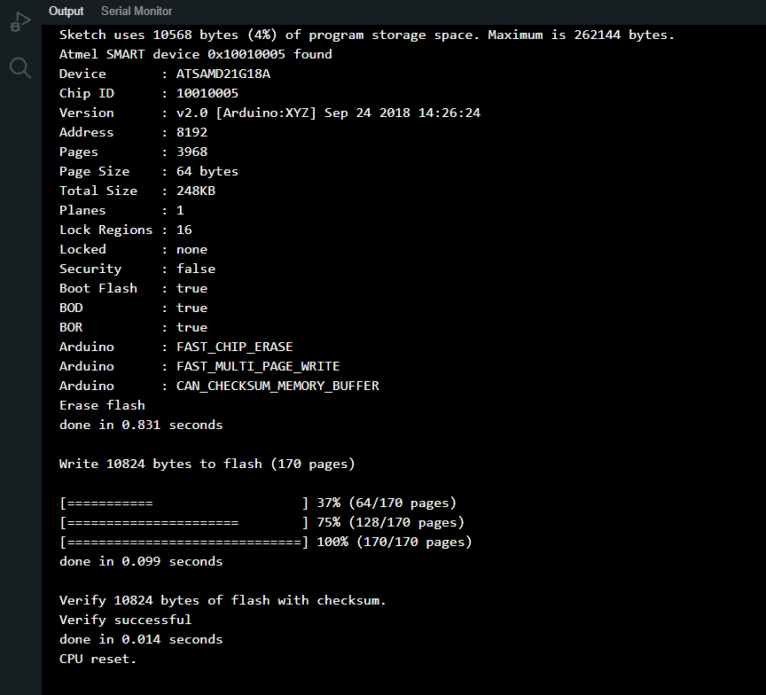
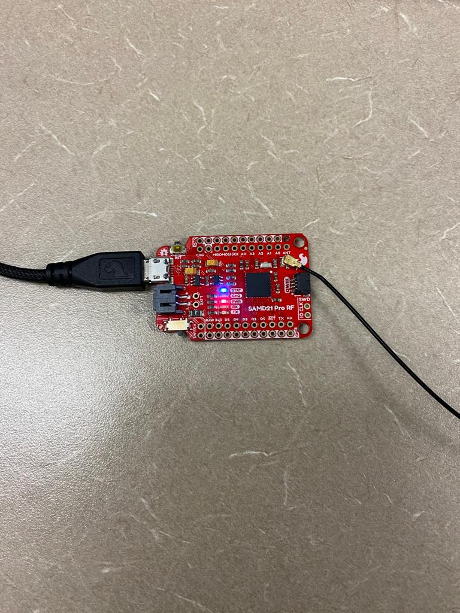
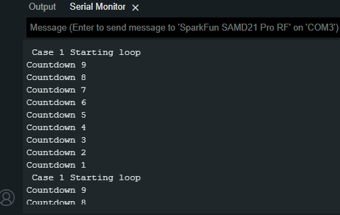
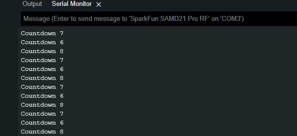
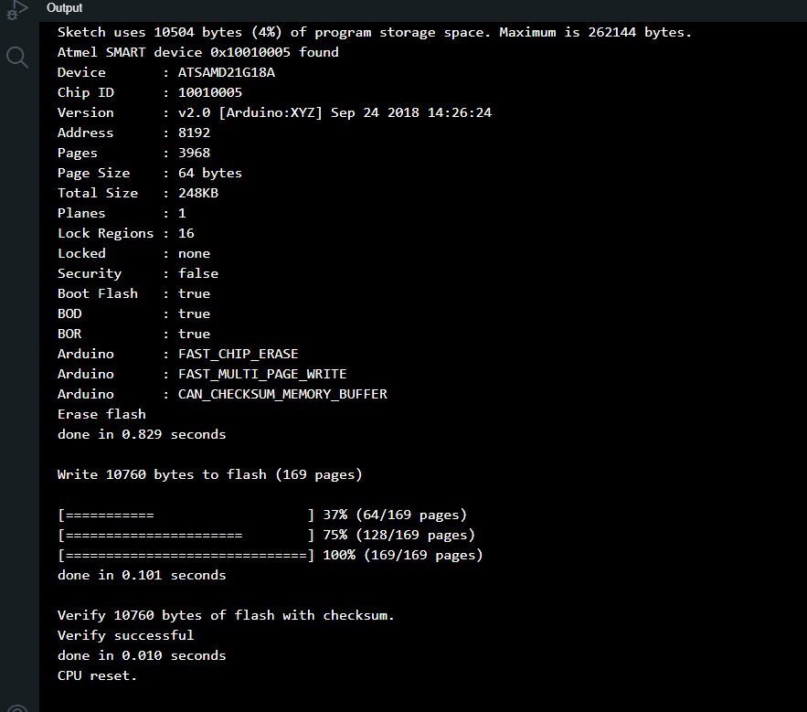
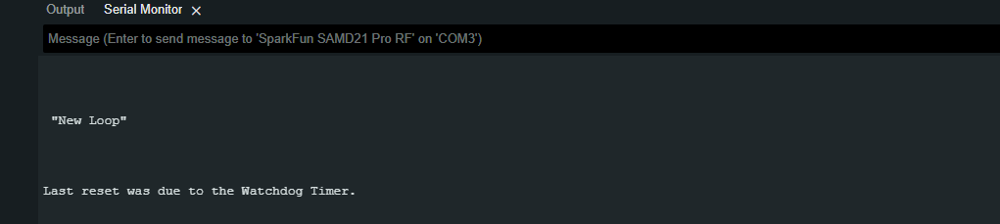
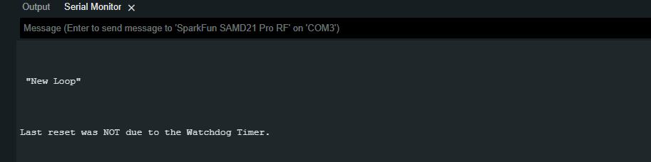

<div align="center">

# Internet of Things lab 1 Fall 2023

## Avhishek Biswas

</div>

  
## Task 1 :

### 1. Requirements:

1. SparkFun SAMD21 Pro RF
2. Laptop with Arduino 2.2.1 installed
3. Atmel-42181-SAM-D21_Datasheet

### 2. Development Plan:

#### a. Procedure: -

1. Set the serial Output.
2. Set the LED pins high.
3. Set the time of the clock to 32 KHz.
4. Initialize the clock to 2048 Hz.
5. Disable the Watchdog Timer.
6. Wait for synchronization.
7. Initialize the clock watchdog timer.
8. Set the timer to be 2 second by keeping Register value to 0x09.
9. Enable the timer.

#### b. Configuration:- 

1. Setting the BUILDIN_PIN high.
2. Clock set to 32 KHz
3. Watchdog timer first disabled, 
4. Timer window set to 2 seconds.
5. Enable the Watchdog timer.

### 3. Test Plan:
1. First set the LED high, and print something in the void loop.
2. Set the clock frequency to 2048 Hz.
3. Disable the Watchdog.
4. Configure Watchdog and Enable it.
5. Test with differernt register setting from 0x07 to 0x0A to find the optimal setting to get 2 seconds of wait time.

### 4. Results:

#### 1. Set up a WDT that reset without clearing it.

```arduino

void setup() {

// Initialize the blue LED pin as an output (assuming it's connected to pin 7)
SerialUSB.begin(9600); // Set the baud rate to 9600
pinMode(LED_BUILTIN, OUTPUT);
digitalWrite(LED_BUILTIN, HIGH); // Set the blue LED HIGH at the beginning

GCLK->GENDIV.reg = GCLK_GENDIV_ID(2) | GCLK_GENDIV_DIV(3);

// Disable the watchdog
WDT->CTRL.reg = 0;

// Initialize Clock Generator 2 for 2048 Hz
GCLK->GENCTRL.reg = GCLK_GENCTRL_ID(2) |
					GCLK_GENCTRL_GENEN |
					GCLK_GENCTRL_SRC_OSCULP32K |
					GCLK_GENCTRL_DIVSEL;

while(GCLK->STATUS.bit.SYNCBUSY); // Think about why this is used
 
GCLK->CLKCTRL.reg = GCLK_CLKCTRL_ID_WDT |
					GCLK_CLKCTRL_CLKEN |
					GCLK_CLKCTRL_GEN_GCLK2;

while (WDT->STATUS.bit.SYNCBUSY); // Wait for synchronizatioN

// set the timer to 2 sec
WDT->CONFIG.bit.PER = 0x09; // Set the timeout period to 2 seconds

// Enable the WDT
WDT->CTRL.bit.ENABLE = 1; // ENABLE WDT
while(GCLK->STATUS.bit.SYNCBUSY); // Think about why this is used
}
void loop() {
// Do nothing
}
```
---

#### 2. Set the Blue LED at the beginning of the program.

```arduino

SerialUSB.begin(9600); // Set the baud rate to 9600
pinMode(LED_BUILTIN, OUTPUT);
digitalWrite(LED_BUILTIN, HIGH); // Set the blue LED HIGH at the beginning
```
---

#### 3. Clock (clock generator 2) frequency: 2048 Hz

```arduino
GCLK->GENDIV.reg = GCLK_GENDIV_ID(2) | GCLK_GENDIV_DIV(3);
```
---

#### 4. Set the WDT period to 2 seconds.

```arduino
// set the timer to 2 sec
WDT->CONFIG.bit.PER = 0x09; // Set the timeout period to 2 seconds
```
---

#### 5. Observe the behavior of the blue LED.
<p>
The LED blinked after every 2 seconds interval. As can be seen in Fig. 2.
</p>
  
---

### Output:
  <figure>
  
  <figcaption style="font-weight: bold;">Fig.1 - Console Output.</figcaption>
</figure>

---
### Screenshot

<figure style="text-align: center;">
  
  <figcaption style="font-weight: bold;">Fig.2 - Working of LED through with blinking for 2 sec.</figcaption>
</figure>

---

### Video Link

##### See working video -  [Link to Video](https://drive.google.com/file/d/1FsiOR0oDF7YoU7RTfc7mKDQJh3zHt6_i/view?usp=sharing).

---
---
<div style="margin-top: 200px;"></div>

## Task 2 :
### Case 1-

### 1. Requirements:

1. SparkFun SAMD21 Pro RF
2. Laptop with Arduino 2.2.1 installed
3. Atmel-42181-SAM-D21_Datasheet


### 2. Development Plan:

#### a. Procedure: -

1. Set the serial Output.
2. Set the LED pins high.
3. Set the time of the clock to 32 KHz.
4. Initialize the clock to 2048 Hz.
5. Disable the Watchdog Timer.
6. Wait for synchronization.
7. Initialize the clock watchdog timer.
8. Set the timer to be 2 second by keeping Register value to 0x09.
9. Enable the timer.
10. Add for loop to the in the void loop() function. 
11. Add code to kick the timer inside the loop.
12. Add a delay of 1 sec.


#### b. Configuration:- 

1. Setting the BUILDIN_PIN high.
2. Clock set to 32 KHz
3. Watchdog timer first disabled, 
4. Timer window set to 2 seconds.
5. Enable the Watchdog timer.

### 3. Test Plan:
1. Add a print statement in the void loop().
2. Add a delay after the print statement, this will print slower.
3. Add the for loop and check if the loop is complete.
4. Add the code to kick the code to make the watchdog running without resetting.

### 4. Results:


#### 1. Set the Blue LED at the beginning of the program.

```arduino
pinMode(LED_BUILTIN, OUTPUT);
digitalWrite(LED_BUILTIN, HIGH); // Set the blue LED HIGH at the beginning
```
---
#### 2. Clock (clock generator 2) frequency: 2048 Hz

```arduino
GCLK->GENDIV.reg = GCLK_GENDIV_ID(2) | GCLK_GENDIV_DIV(3);
```
---
#### 3. Set the loop period to 1 second, loop 10 times in the main loop () function such that it repeats.

```arduino
for (int loopCount = 9; loopCount > 0; loopCount--) {
	//print the countdown
	SerialUSB.print("Countdown ");
	SerialUSB.println(loopCount);
	WDT->CLEAR.reg = WDT_CLEAR_CLEAR_KEY;
	delay(1000); // setting the loop period to 1 second
}
```
---
  

#### 4. Clear(kick) the WDT in the loop

```arduino
WDT->CLEAR.reg = WDT_CLEAR_CLEAR_KEY;
```
---
  

#### 5. Count down the number of loops and print a countdown message.

```arduino
for (int loopCount = 9; loopCount > 0; loopCount--) {
SerialUSB.print("Countdown ");
SerialUSB.println(loopCount);
// internal code to print and control WDT
}
```
---
  

#### 6. Set the period using the delay(ms) function.

```arduino
delay(1000); // setting the loop period to 1 second
```
---
  

#### 7. Set the WDT period to 4 seconds.

```arduino
WDT->CONFIG.bit.PER = 0x0A; // Set the timeout period to 4 seconds
```
---

### Output 

  <figure>
  
  <figcaption>Fig.3 - Console Output for Task 2 Case 1.</figcaption>
</figure>

---

### Screenshot

<figure style="text-align: center;">
  
  <figcaption style="font-weight: bold;">Fig.4 - LED remaining static throughout the execution.</figcaption>
</figure>


<figure style="text-align: center;">
  
  <figcaption style="font-weight: bold;">Fig 5. Countdown Timer Output.</figcaption>
</figure>

---

### Video Link - 


##### See working video -  [Link to Video](https://drive.google.com/file/d/116Vig73lDD8r-KSvyK7foeu4gg6X4bo1/view?usp=sharing).

---


<div style="margin-top: 100px;"></div>

### Case 2:

### 1. Requirements:

1. SparkFun SAMD21 Pro RF
2. Laptop with Arduino 2.2.1 installed
3. Atmel-42181-SAM-D21_Datasheet


### 2. Development Plan:

#### a. Procedure: -

1. Set the serial Output.
2. Set the LED pins high.
3. Set the time of the clock to 32 KHz.
4. Initialize the clock to 2048 Hz.
5. Disable the Watchdog Timer.
6. Wait for synchronization.
7. Initialize the clock watchdog timer.
8. Set the timer to be 2 second by keeping Register value to 0x09.
9. Enable the timer.
10. Add for loop to the in the void loop() function. 
11. Comment code to kick the timer inside the loop.
12. Add a delay of 1 sec.


#### b. Configuration:- 

1. Setting the BUILDIN_PIN high.
2. Clock set to 32 KHz
3. Watchdog timer first disabled, 
4. Timer window set to 2 seconds.
5. Enable the Watchdog timer.

### 3. Test Plan:
1. Add a print statement in the void loop().
2. Add a delay after the print statement, this will print slower.
3. Add the for loop and check if the loop is complete.
4. Comment the code to kick the code to make the watchdog running without resetting.


### 4. Results:

  

#### Compare case 1 with clearing WDT and case 2 without clearing WDT and record the system behavior from the LED and the serial monitor message.

```arduino

for (int loopCount = 9; loopCount > 0; loopCount--) {
	//print the countdown
	SerialUSB.print("Countdown ");
	SerialUSB.println(loopCount);
	//comment the clear code
	//WDT->CLEAR.reg = WDT_CLEAR_CLEAR_KEY;
	delay(1000);
}
```
---
  
  

#### Discuss and explain the differences between the two cases.

<p>The visual difference can be seen by carefully following the LED, in the first case the LED will be static and will keep on being in the ON state as the Watchdog timer is getting kicked before it can reset. Due to this the countdown will go from Count 9 to Count 0 as shown in Fig.7 .</p>

<p>For the Second case, as we comment out the code that kicks the Watchdog therefore it resets the MCU. As a result we will see that the LED starts blinking after every 4 sec, because the watchdog timer is set to a window of 4 sec. Beacuse of the reset the the Countdown timer in the for loop does not get to reset, as a result while the timer is going it will reset and we see only the first few counts from 9 to 0 as shown in Fig.8 . </p>

---
### Output

  <figure>
  
  <figcaption>Fig.6 - Console Output for Task 2 Case 2.</figcaption>
</figure>

---
### Screenshot

<figure style="text-align: center;">
  
  <figcaption style="font-weight: bold;">Fig.7 - Working of LED with blinking for 4 sec.</figcaption>
</figure>


<figure style="text-align: center;">
  
  <figcaption style="font-weight: bold;">Fig 8. Countdown Timer Output.</figcaption>
</figure>

---

### Video Link - 


##### See working video -  [Link to Video](https://drive.google.com/file/d/116Vig73lDD8r-KSvyK7foeu4gg6X4bo1/view?usp=sharing).

---
---

<div style="margin-top: 200px;"></div>


## Task 3 :

### 1. Requirements:

1. SparkFun SAMD21 Pro RF
2. Laptop with Arduino 2.2.1 installed
3. Atmel-42181-SAM-D21_Datasheet

### 2. Development Plan:

#### a. Procedure: -

1. Set the serial Output.
2. Set the LED pins high.
3. Set the time of the clock to 32 KHz.
4. Initialize the clock to 2048 Hz.
5. Disable the Watchdog Timer.
6. Wait for synchronization.
7. Initialize the clock watchdog timer.
8. Create another function that takes period input in milisecond and converts it into frequency of watchdog.
9. loop through values of clock of watchdog timers. 
10. Find the smallest or equal value of freqeuncy and clock of watchdog, this does the floor function.
11. Set the value to the return variable with corresponding clock freqency of watchdog timer.
12. Set the timer of watchdog in void setup() to the return variable.
13. Enable the Watchdog timer.

#### b. Configuration:- 

1. Setting the BUILDIN_PIN high.
2. Clock set to 32 KHz
3. Watchdog timer first disabled, 
4. Timer window set to 2 seconds.
5. Enable the Watchdog timer.

### 3. Test Plan:
1. First set the LED high, and print something in the void loop.
2. Set the clock frequency to 2048 Hz.
3. Disable the Watchdog.
4. Configure Watchdog and Enable it.
5. Test with 3 different values of period, 1000, 2000 and 5000.
6. With the 1000, the blinking will be close to 1 sec and will be very fast.
7. With 2000, the blinking will be around 2 sec.
8. With 5000, the blinking will be around 4 sec.
   
   

### 4. Results:  

#### 1. Write a function that generates a WDT period by arbitrary input

  

```arduino
int setWatchdog(int period)
{
// Convert the period from milliseconds to clock cycles
int clock_frequency = 2048;
int desired_cycles = period * clock_frequency / 1000;

// Define an array of available WDT periods in clock cycles
int available_cycles[] = {8, 16, 32, 64, 128, 256, 512, 1024, 2048, 4096, 8192, 16384};
int register_values_per_cycles[] = {0x0, 0x01, 0x02, 0x03, 0x04, 0x05, 0x06, 0x07, 0x08, 0x09, 0x0A, 0X0B};
// Initialize register_value to the smallest available period
int register_value = 0x0;

// Loop through the array to find the closest available period that is less than or equal to the desired period
for (int i = 0; i < sizeof(available_cycles) / sizeof(available_cycles[0]); ++i) 
{
	// find the closest cycle based on the floor calculation
	if (available_cycles[i] <= desired_cycles) {
	// register_value = register_values_per_cycles[i]; // Register values are indexed from 0x0
	register_value = i;
	} else {
	break; // Exit the loop as soon as we find a period greater than the desired period
	}
}

// register_value = 0x0A;

return register_value;
}
```
---
  

#### 2. Clock (clock generator 2) frequency: 2048 Hz

  

```arduino
GCLK->GENDIV.reg = GCLK_GENDIV_ID(2) | GCLK_GENDIV_DIV(3);
```

---  
  

#### 3. Function input: period (millisecond)

##### Test 1- 2000 milliseconds
```arduino
// set the timer to n milisecond
WDT->CONFIG.bit.PER = setWatchdog(2000);
```

##### Test 2- 5000 milliseconds
```arduino
// set the timer to n milisecond
WDT->CONFIG.bit.PER = setWatchdog(5000);
```
---

#### 4a. Calculate the register value based on the period

```arduino
// Convert the period from milliseconds to clock cycles
int clock_frequency = 2048;
int desired_cycles = period * clock_frequency / 1000;
```

#### 4b. Take the floor to the closest value for values that cannot be mapped to register value.

  

```arduino

// Loop through the array to find the closest available period that is less than or equal to the desired period
for (int i = 0; i < sizeof(available_cycles) / sizeof(available_cycles[0]); ++i) 
{
	// find the closest cycle based on the floor calculation
	if (available_cycles[i] <= desired_cycles) {
	// register_value = register_values_per_cycles[i]; // Register values are indexed from 0x0
	register_value = i;
	} else {
	break; // Exit the loop as soon as we find a period greater than the desired period
	}
}
```

---
### Output 

<figure style="text-align: center;">
  
  <figcaption style="font-weight: bold;">Fig.9 - Console Output for Task 3.</figcaption>
</figure>
  
---
### Screenshot

<figure style="text-align: center;">
  
  <figcaption style="font-weight: bold;">Fig.10 - Working of LED with blinking for 2000 milisecond.</figcaption>
</figure>

<figure style="text-align: center;">
  
  <figcaption style="font-weight: bold;">Fig.11 - Working of LED with blinking for 5000 milisecond.</figcaption>
</figure>
---

### Video Link - 


##### See working video for test 1 at 2000 milisecond -  [Link to Video](https://drive.google.com/file/d/16Te1ROhPbCGvTe9gYlMIvyvkRu7HR9CD/view?usp=sharing).


##### See working video for test 2 at 5000 milisecond -  [Link to Video](https://drive.google.com/file/d/1dqsHXUQT4KfcHDMZAUSzvWz-EsszYq6H/view?usp=sharing).


---
---

<div style="margin-top: 200px;"></div>


### Task 4 :

### 1. Requirements:

1. SparkFun SAMD21 Pro RF
2. Laptop with Arduino 2.2.1 installed
3. Atmel-42181-SAM-D21_Datasheet

### 2. Development Plan:

#### a. Procedure: -

1. Set the serial Output.
2. Set the LED pins high.
3. Set the time of the clock to 32 KHz.
4. Initialize the clock to 2048 Hz.
5. Disable the Watchdog Timer.
6. Wait for synchronization.
7. Initialize the clock watchdog timer.
8. Set the timer to be 2 second by keeping Register value to 0x09.
9.  In the Void Loop() add code to check the value of RCAUSE register from Power Manager, which has bit 5 as a representation of Watchdog reset. 
10. Enable the Watchdog Timer.

#### b. Configuration:- 

1. Setting the BUILDIN_PIN high.
2. Clock set to 32 KHz
3. Watchdog timer first disabled, 
4. Timer window set to 2 seconds.
5. Enable the Watchdog timer.
6. Add an ifelse block in void loop to check the 5th bit of RCAUSE register and print if True.

### 3. Test Plan:
1. First set the LED high, and print something in the void loop.
2. Set the clock frequency to 2048 Hz.
3. Disable the Watchdog.
4. Configure Watchdog and Enable it.
5. Run code to find the print statement in the serial output.

#### 1. After a reset event is there a way for the MCU to figure out if the last reset was due to WDT? If yes,
<p>
Yes, the SAMD21, provides a way to determine the cause of the last reset. This is done through a specific register that holds reset flags. In the case of the SAMD21, we can check the RCAUSE register to determine if the last reset was due to the Watchdog Timer (WDT). The 5th bit of this register is set if the last reset was caused by the WDT.
</p>

---

#### 2. Write code that detects if the last reset was due to WDT:
```arduino
// Check if the last reset was due to the Watchdog Timer

if (PM->RCAUSE.reg & (1 << 5)) { // WDT is the 5th bit in RCAUSE
	SerialUSB.println("Last reset was due to the Watchdog Timer.");
	}
else {
	SerialUSB.println("Last reset was NOT due to the Watchdog Timer.");
}
```
---
#### 3. If it was due to WDT, print a message in the console
	```
	SerialUSB.println("Last reset was due to the Watchdog Timer.");
	```
---    
#### 4. What could be the importance of checking if the last reset was due to WDT?

<p>

Importance of Checking for WDT Reset
- **Debugging**: Helps identify software issues that led to the reset.
- **Fault Recovery**: Enables corrective actions like entering safe mode.
- **Data Integrity**: Triggers data verification if reset during critical operations.
- **User Notification**: Alerts users if manual intervention is needed.
- **System Health**: Useful for monitoring and maintenance.


By checking the WDT reset cause, the system can make informed decisions, enhancing its reliability.
</p>


### Screenshot

<figure style="text-align: center;">
  
  <figcaption style="font-weight: bold;">Fig 12 -The RCAUSE register has WDT reset bit as 1, showing that there was reset. </figcaption>
</figure>

<figure style="text-align: center;">
  
  <figcaption style="font-weight: bold;">Fig 13 - The RCAUSE register has WDT reset bit as 0, showing that there was no reset.</figcaption>
</figure>

---
---
---


## Appendix 
The following codes for the different tasks:

### Task 1:
```arduino
void setup() {
  // Initialize the blue LED pin as an output (assuming it's connected to pin 7)
  SerialUSB.begin(9600); // Set the baud rate to 9600
  
  pinMode(LED_BUILTIN, OUTPUT);
  
  digitalWrite(LED_BUILTIN, HIGH); // Set the blue LED HIGH at the beginning

  GCLK->GENDIV.reg = GCLK_GENDIV_ID(2) | GCLK_GENDIV_DIV(3);
  
  // Disable the watchdog
  WDT->CTRL.reg = 0;

  // Initialize Clock Generator 2 for 2048 Hz
  GCLK->GENCTRL.reg = GCLK_GENCTRL_ID(2) |
                      GCLK_GENCTRL_GENEN |
                      GCLK_GENCTRL_SRC_OSCULP32K |
                      GCLK_GENCTRL_DIVSEL;

  while(GCLK->STATUS.bit.SYNCBUSY); // Think about why this is used

  GCLK->CLKCTRL.reg = GCLK_CLKCTRL_ID_WDT |
  GCLK_CLKCTRL_CLKEN |
  GCLK_CLKCTRL_GEN_GCLK2;

  while (WDT->STATUS.bit.SYNCBUSY); // Wait for synchronization

  // set the timer to 2 sec
  WDT->CONFIG.bit.PER = 0x09; // Set the timeout period to 2 seconds
  
  // Enable the WDT
  WDT->CTRL.bit.ENABLE = 1; //  ENABLE WDT

  while(GCLK->STATUS.bit.SYNCBUSY); // Think about why this is used

}

void loop() {
  // Do nothing
}

```

### Task 2:
```arduino
void setup() {
  // Initialize the blue LED pin as an output (assuming it's connected to pin 7)
  SerialUSB.begin(9600); // Set the baud rate to 9600
  
  pinMode(LED_BUILTIN, OUTPUT);
  
  digitalWrite(LED_BUILTIN, HIGH); // Set the blue LED HIGH at the beginning

  GCLK->GENDIV.reg = GCLK_GENDIV_ID(2) | GCLK_GENDIV_DIV(3);
  
  // Disable the watchdog
  WDT->CTRL.reg = 0;

  // Initialize Clock Generator 2 for 2048 Hz
  GCLK->GENCTRL.reg = GCLK_GENCTRL_ID(2) |
                      GCLK_GENCTRL_GENEN |
                      GCLK_GENCTRL_SRC_OSCULP32K |
                      GCLK_GENCTRL_DIVSEL;

  while(GCLK->STATUS.bit.SYNCBUSY); // Think about why this is used

  GCLK->CLKCTRL.reg = GCLK_CLKCTRL_ID_WDT |
  GCLK_CLKCTRL_CLKEN |
  GCLK_CLKCTRL_GEN_GCLK2;

  while (WDT->STATUS.bit.SYNCBUSY); // Wait for synchronization

  // set the timer to 2 sec
  WDT->CONFIG.bit.PER = 0x0A; // Set the timeout period to 4 seconds
  SerialUSB.println("enabling WDT");
  // Enable the WDT
  WDT->CTRL.bit.ENABLE = 1; //  ENABLE WDT
  WDT->INTENCLR.bit.EW = 1; // Disable early warning interrupt
  WDT->CTRL.bit.WEN = 0; // Disable window mode


}

void loop() {
  
  SerialUSB.println(" Case 1 Starting loop ");
  // Loop ten times
  for (int loopCount = 9; loopCount > 0; loopCount--) {
    //print the countdown
    SerialUSB.print("Countdown ");
    SerialUSB.println(loopCount);
    WDT->CLEAR.reg = WDT_CLEAR_CLEAR_KEY;
    delay(1000);
  }
}

```

#### Case 2:

```arduino
void setup() {
  // Initialize the blue LED pin as an output (assuming it's connected to pin 7)
  SerialUSB.begin(9600); // Set the baud rate to 9600
  
  pinMode(LED_BUILTIN, OUTPUT);
  
  digitalWrite(LED_BUILTIN, HIGH); // Set the blue LED HIGH at the beginning

  GCLK->GENDIV.reg = GCLK_GENDIV_ID(2) | GCLK_GENDIV_DIV(3);
  
  // Disable the watchdog
  WDT->CTRL.reg = 0;

  // Initialize Clock Generator 2 for 2048 Hz
  GCLK->GENCTRL.reg = GCLK_GENCTRL_ID(2) |
                      GCLK_GENCTRL_GENEN |
                      GCLK_GENCTRL_SRC_OSCULP32K |
                      GCLK_GENCTRL_DIVSEL;

  while(GCLK->STATUS.bit.SYNCBUSY); // Think about why this is used

  GCLK->CLKCTRL.reg = GCLK_CLKCTRL_ID_WDT |
  GCLK_CLKCTRL_CLKEN |
  GCLK_CLKCTRL_GEN_GCLK2;

  while (WDT->STATUS.bit.SYNCBUSY); // Wait for synchronization

  // set the timer to 2 sec
  WDT->CONFIG.bit.PER = 0x0A; // Set the timeout period to 4 seconds
  SerialUSB.println("enabling WDT");
  
  // Enable the WDT
  WDT->CTRL.bit.ENABLE = 1; //  ENABLE WDT
  WDT->INTENCLR.bit.EW = 1; // Disable early warning interrupt
  WDT->CTRL.bit.WEN = 0; // Disable window mode


}

void loop() {
  
  SerialUSB.print(" Case 2 Starting loop ");
  // Loop ten times
  for (int loopCount = 9; loopCount > 0; loopCount--) {
    //print the countdown
    SerialUSB.print("Countdown ");
    SerialUSB.println(loopCount);
    // WDT->CLEAR.reg = WDT_CLEAR_CLEAR_KEY;
    delay(1000);
  }
}

```

### Task 3:
```arduino
int setWatchdog(int period)
{
  // Convert the period from milliseconds to clock cycles
  int clock_frequency = 2048;
  int desired_cycles = period * clock_frequency / 1000;
  
  // Define an array of available WDT periods in clock cycles
  int available_cycles[] = {8,     16,   32,   64,  128,  256,  512, 1024, 2048, 4096, 8192, 16384};
  int register_values_per_cycles[] = {0x0, 0x01, 0x02, 0x03, 0x04, 0x05, 0x06, 0x07, 0x08, 0x09, 0x0A, 0X0B};
  // Initialize register_value to the smallest available period
  int register_value = 0x0;

  // Loop through the array to find the closest available period that is less than or equal to the desired period
  for (int i = 0; i < sizeof(available_cycles) / sizeof(available_cycles[0]); ++i) {
    // find the closest cycle based on the floor calculation 
    if (available_cycles[i] <= desired_cycles) { 
      // register_value = register_values_per_cycles[i];  // Register values are indexed from 0x0
      register_value = i;
    } else {
      break;  // Exit the loop as soon as we find a period greater than the desired period
    }
  }  
  // register_value = 0x0A;
  return register_value;
}


void setup() {
  // Initialize the blue LED pin as an output (assuming it's connected to pin 7)
  SerialUSB.begin(9600); // Set the baud rate to 9600
  
  pinMode(LED_BUILTIN, OUTPUT);
  
  digitalWrite(LED_BUILTIN, HIGH); // Set the blue LED HIGH at the beginning

  GCLK->GENDIV.reg = GCLK_GENDIV_ID(2) | GCLK_GENDIV_DIV(3);
  
  // Disable the watchdog
  WDT->CTRL.reg = 0;

  // Initialize Clock Generator 2 for 2048 Hz
  GCLK->GENCTRL.reg = GCLK_GENCTRL_ID(2) |
                      GCLK_GENCTRL_GENEN |
                      GCLK_GENCTRL_SRC_OSCULP32K |
                      GCLK_GENCTRL_DIVSEL;

  while(GCLK->STATUS.bit.SYNCBUSY); // Think about why this is used

  GCLK->CLKCTRL.reg = GCLK_CLKCTRL_ID_WDT |
  GCLK_CLKCTRL_CLKEN |
  GCLK_CLKCTRL_GEN_GCLK2;

  while (WDT->STATUS.bit.SYNCBUSY); // Wait for synchronization

  // set the timer to n milisec
  WDT->CONFIG.bit.PER = setWatchdog(5000); 
  
  // Enable the WDT
  WDT->CTRL.bit.ENABLE = 1; //  ENABLE WDT

  while(GCLK->STATUS.bit.SYNCBUSY); // Think about why this is used

}

void loop() {
    // Do nothing
}

```

### Task 4:

```arduino
void setup() {
  // Initialize the blue LED pin as an output (assuming it's connected to pin 7)
  SerialUSB.begin(9600); // Set the baud rate to 9600
  
  pinMode(LED_BUILTIN, OUTPUT);
  
  digitalWrite(LED_BUILTIN, HIGH); // Set the blue LED HIGH at the beginning

  GCLK->GENDIV.reg = GCLK_GENDIV_ID(2) | GCLK_GENDIV_DIV(3);
  
  // Disable the watchdog
  WDT->CTRL.reg = 0;

  // Initialize Clock Generator 2 for 2048 Hz
  GCLK->GENCTRL.reg = GCLK_GENCTRL_ID(2) |
                      GCLK_GENCTRL_GENEN |
                      GCLK_GENCTRL_SRC_OSCULP32K |
                      GCLK_GENCTRL_DIVSEL;

  while(GCLK->STATUS.bit.SYNCBUSY); // Think about why this is used

  GCLK->CLKCTRL.reg = GCLK_CLKCTRL_ID_WDT |
  GCLK_CLKCTRL_CLKEN |
  GCLK_CLKCTRL_GEN_GCLK2;

  while (WDT->STATUS.bit.SYNCBUSY); // Wait for synchronization

  // set the timer to 2 sec
  WDT->CONFIG.bit.PER = 0x09; // Set the timeout period to 2 seconds
  
  // Enable the WDT
  WDT->CTRL.bit.ENABLE = 1; //  ENABLE WDT

  while(GCLK->STATUS.bit.SYNCBUSY); // Think about why this is used

}

void loop() {
    
  SerialUSB.println("\n\n\n \"New Loop\" \n\n\n");
    // Check if the last reset was due to the Watchdog Timer
    if (PM->RCAUSE.reg & (1 << 5)) {  // WDT is the 5th bit in RCAUSE
    SerialUSB.println("Last reset was due to the Watchdog Timer.");
    } 
  else {
    SerialUSB.println("Last reset was NOT due to the Watchdog Timer.");
    }
}
```