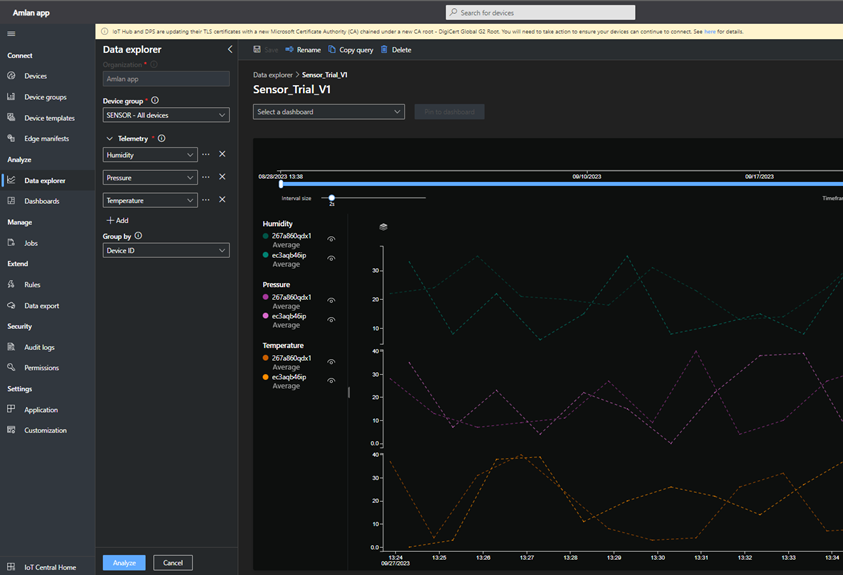
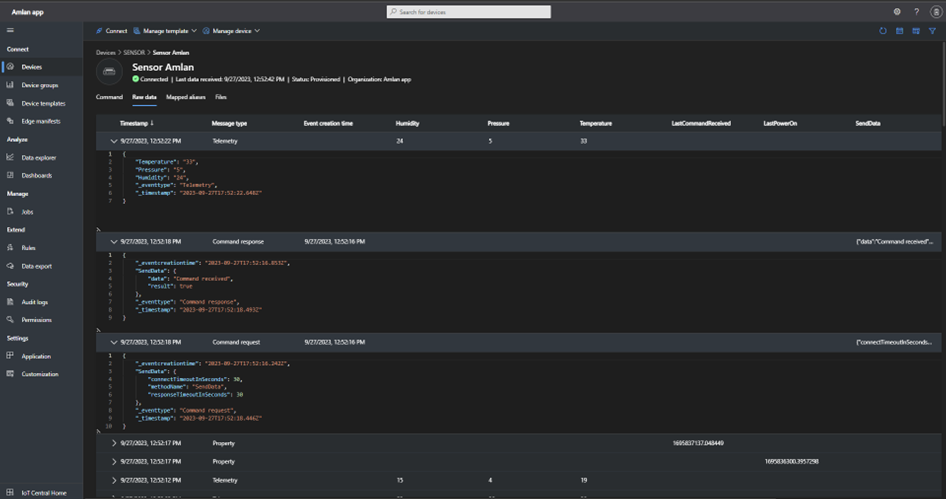
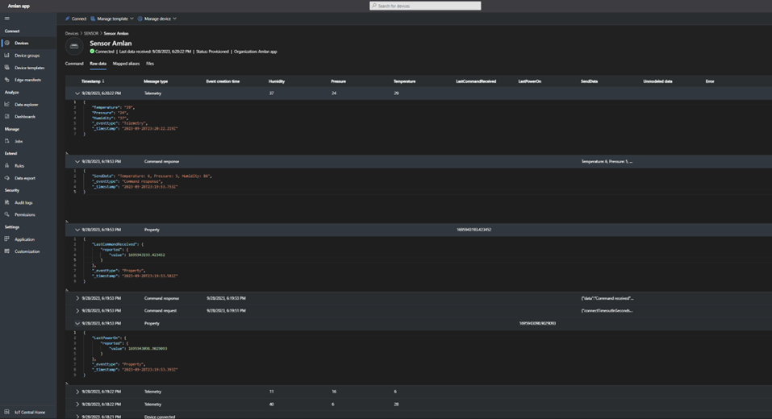

<div align="center">

# Internet of Things lab 5 Fall 2023

## Group 2 : Avhishek Biswas, Anuruddha Ekanayake, Amlan Balabantaray, Shaswati Behera
</div>


  
## Task 1 : In IoT Central and Device

### Requirements
1. Configuring IoT Central

    a. Configure a single IoT Central app (one per team) to observe telemetry of multiple virtual IoT devices that send temperature, pressure, and humidity data and receive  SendData  commands. The virtual IoT devices should also send LastCommandReceived  and  LastPowerOn  property to record the epoch times for when the device last received a command and when they were last powered on.
    b. Create a device per team member.
    c. Create dashboard with charts for every telemetry data type that will be received. This should include data from all the devices.

2. Configure Device 

   a. Implement device code to send temperature, pressure, and humidity using the iotc  library. You can simulate the actual values. A device should send data every 60 seconds or whenever it receives a command from IoT Central. It should also send properties whenever appropriate.
   b. Configure the device code in each of the team member's laptop.
---

#### Development Plan:

#### a. Procedure of Solving the Problem
1. Create an App in IoT Central.
2. Add a device template in the App. We call the device template as Sensor.
3. Create a Device after going to the device tab, configure the device to use the Sensor template.
4. Go to the connect tab and copy the Scope ID, Device ID and the primary key.
5. Paste these above copied values in the **IOTC** connection code.


#### b. Run-time Errors
| Error Code       | Error |
|--------------|--------|
 |Connect_Fail  |fail connection to IoT central
 |Config | Wrong configuration of the template


---


### 2. Test Output:

#### Subtask 1:
##### Subpart a.
We configured 2 IoT Central App, each communicating to 2 members in our team.

Avhi_App -  Configured to Avhishek and Anuruddha

Amlan_App - Configured to Amlan and Shaswati


<figure style="text-align: center;">
  
  <figcaption style="font-weight: bold;">Fig : Output showing data from 2 configured devices in Avhi App.</figcaption>
</figure>

<figure style="text-align: center;">
  
  <figcaption style="font-weight: bold;">Fig : Output showing data from 2 configured devices in Amlan App.</figcaption>
</figure>


##### Subpart b.
<figure style="text-align: center;">
  
  <figcaption style="font-weight: bold;">Fig 1:Avhi App Devices page showing 2 connected devices </figcaption>
</figure>

<figure style="text-align: center;">
  
  <figcaption style="font-weight: bold;">Fig 1:Amlan App Devices page showing 2 connected devices</figcaption>
</figure>

##### Screenshots:

##### Outputs from Avhi:

<figure style="text-align: center;">
  
  <figcaption style="font-weight: bold;">Fig : Raw data in Avhi App for sensor of Avhishek, showing data from Temperature, Pressure and Humidity.</figcaption>
</figure>

<figure style="text-align: center;">
  
  <figcaption style="font-weight: bold;">Fig : Raw data in Avhi App for sensor of Avhishek, being sent every 60 seconds. </figcaption>
</figure>

<figure style="text-align: center;">
  
  <figcaption style="font-weight: bold;">Fig : Output of LastPowerOn and LastCommandRecieved Command.</figcaption>
</figure>

<figure style="text-align: center;">
  
  <figcaption style="font-weight: bold;">Fig : Telemetry Command Recieved.</figcaption>
</figure>

<figure style="text-align: center;">
  
  <figcaption style="font-weight: bold;">Fig : Telemetry command output</figcaption>
</figure>


##### Outputs from Anu:

<figure style="text-align: center;">
  
  <figcaption style="font-weight: bold;">Fig : Raw data in Avhi App for sensors of Anuruddha, showing data from Temperature, Pressure and Humidity.</figcaption>
</figure>

<figure style="text-align: center;">
  
  <figcaption style="font-weight: bold;">Fig : Raw data in Avhi App for sensors of Anuruddha, being sent every 60 seconds. </figcaption>
</figure>

<figure style="text-align: center;">
  
  <figcaption style="font-weight: bold;">Fig : Telemetry Command Recieved.</figcaption>
</figure>

<figure style="text-align: center;">
  
  <figcaption style="font-weight: bold;">Fig : Telemetry command output</figcaption>
</figure>

##### Outputs from Amlan:

<figure style="text-align: center;">
  
  <figcaption style="font-weight: bold;">Fig : Raw data in Amlan App for sensors of Amlan, showing data from Temperature, Pressure and Humidity.</figcaption>
</figure>

<figure style="text-align: center;">
  
  <figcaption style="font-weight: bold;">Fig : Raw data in Amlan App for sensors of Amlan, being sent every 60 seconds. </figcaption>
</figure>

<figure style="text-align: center;">
  
  <figcaption style="font-weight: bold;">Fig : Output of LastPowerOn and LastCommandRecieved Command.</figcaption>
</figure>

<figure style="text-align: center;">
  
  <figcaption style="font-weight: bold;">Fig : Telemetry command output</figcaption>
</figure>

##### Outputs from Shaswati:

<figure style="text-align: center;">
  
  <figcaption style="font-weight: bold;">Fig : Raw data in Amlan App for sensors of Shaswati, showing data from Temperature, Pressure and Humidity.</figcaption>
</figure>

<figure style="text-align: center;">
  
  <figcaption style="font-weight: bold;">Fig : Raw data in Amlan App for sensors of Shaswati, being sent every 60 seconds. </figcaption>
</figure>

<figure style="text-align: center;">
  
  <figcaption style="font-weight: bold;">Fig : Output of LastPowerOn and LastCommandRecieved Command.</figcaption>
</figure>

<figure style="text-align: center;">
  
  <figcaption style="font-weight: bold;">Fig : Output of telemetry Command Recieved.</figcaption>
</figure>

<figure style="text-align: center;">
  
  <figcaption style="font-weight: bold;">Fig : Telemetry command recieved in device. </figcaption>
</figure>

---


---
---
#### Subtask 2: 
##### Subpart a and b.

To send the temperature, pressure and humidity, we add more fields in the json data. Which also sends the data after 60secs which is configured in time.sleep().

```python
while iotc.is_connected():
    iotc.send_telemetry({
        'Temperature': str(random.randint(0, 40)),
        'Pressure' : str(random.randint(1, 10)),
        'Humidity' : str(random.randint(0,100))
    })
    # iotc._send_message(str('hello'))
    time.sleep(60)
```

To get the devices to send telemetry when ever it is asked from the IOT Central,first we configure the device template, and then change the code to reply to such a command: 

<figure style="text-align: center;">
  
  <figcaption style="font-weight: bold;">Fig 1:Sensor Template</figcaption>
</figure>


Code to return to the IoT Central -
```python
temp = str(random.randint(0, 40))
pressure = str(random.randint(1, 10))
humidity =  str(random.randint(0,100))

telemetry_str = "Temperature: {}, Pressure: {}, Humidity: {}".format(temp, pressure, humidity)


def on_commands(command: Command):

    print(f"{command.name} command was sent")
    iotc.send_property({
    "LastPowerOn": LastTurnedOn
    })
    iotc.send_property({
    "LastCommandReceived": time.time()
    })
    iotc.send_property({
        "SendTelemetry" : telemetry_str
    })

```
<figure style="text-align: center;">
  
  <figcaption style="font-weight: bold;">Fig : Output showing data from 2 devices in Avhi App.</figcaption>
</figure>

<figure style="text-align: center;">
  
  <figcaption style="font-weight: bold;">Fig : Output showing data from 2 devices in Amlan App.</figcaption>
</figure>
---


<div style="margin-top: 200px;"></div>

---
---

## Appendix

### Amlan and Shaswati :

### Amlan Code :
```python
import random
import time

from iotc.models import Command, Property
from iotc import IoTCClient, IOTCConnectType, IOTCEvents

scope_id = '0ne00AE04F2'
device_id = '267a860qdx1'
device_key = 'kiT+AhhUNj7Nl7+ef3F5oir3OSleJzfi6RQvqPE+V+A='

LastTurnedOn = time.time()
temp = str(random.randint(0, 40))
pressure = str(random.randint(1, 10))
humidity =  str(random.randint(0,100))

telemetry_str = "Temperature: {}, Pressure: {}, Humidity: {}".format(temp, pressure, humidity)


def on_commands(command: Command):

    print(f"{command.name} command was sent")
    iotc.send_property({
    "LastPowerOn": LastTurnedOn
    })
    iotc.send_property({
    "LastCommandReceived": time.time()
    })
    iotc.send_property({
        # "SendTelemetry" : iotc.send_telemetry({
        #                                         'Temperature': str(random.randint(0, 40)),
        #                                         'Pressure' : str(random.randint(1, 10)),
        #                                         'Humidity' : str(random.randint(0,100))
        #                                         })
        "SendTelemetry" : telemetry_str
    })
    


iotc = IoTCClient(
    device_id,
    scope_id,
        IOTCConnectType.IOTC_CONNECT_DEVICE_KEY,
        device_key)

iotc.connect()

iotc.on(IOTCEvents.IOTC_COMMAND, on_commands)

iotc.send_property({
    "LastTurnedOn": time.time()
})

while iotc.is_connected():
    iotc.send_telemetry({
        'Temperature': str(random.randint(0, 40)),
        'Pressure' : str(random.randint(1, 10)),
        'Humidity' : str(random.randint(0,100))
    })
    # iotc._send_message(str('hello'))
    time.sleep(60)

```

### Shaswati Code :

```python
import random
import time

from iotc.models import Command, Property
from iotc import IoTCClient, IOTCConnectType, IOTCEvents

scopeId = '0ne00AE04F2'
device_id = 'ec3aqb46ip'
device_key = 'WDhq8Ep7MheHsWci1qGYqq26XrrimZfJ8nquRgT7A4Y='

LastTurnedOn = time.time()
temp = str(random.randint(0, 40))
pressure = str(random.randint(1, 10))
humidity =  str(random.randint(0,100))

telemetry_str = "Temperature: {}, Pressure: {}, Humidity: {}".format(temp, pressure, humidity)


def on_commands(command: Command):

    print(f"{command.name} command was sent")
    iotc.send_property({
    "LastPowerOn": LastTurnedOn
    })
    iotc.send_property({
    "LastCommandReceived": time.time()
    })
    iotc.send_property({
        # "SendTelemetry" : iotc.send_telemetry({
        #                                         'Temperature': str(random.randint(0, 40)),
        #                                         'Pressure' : str(random.randint(1, 10)),
        #                                         'Humidity' : str(random.randint(0,100))
        #                                         })
        "SendTelemetry" : telemetry_str
    })
    


iotc = IoTCClient(
    device_id,
    scope_id,
        IOTCConnectType.IOTC_CONNECT_DEVICE_KEY,
        device_key)

iotc.connect()

iotc.on(IOTCEvents.IOTC_COMMAND, on_commands)

iotc.send_property({
    "LastTurnedOn": time.time()
})

while iotc.is_connected():
    iotc.send_telemetry({
        'Temperature': str(random.randint(0, 40)),
        'Pressure' : str(random.randint(1, 10)),
        'Humidity' : str(random.randint(0,100))
    })
    # iotc._send_message(str('hello'))
    time.sleep(60)

```

#### Avhi and Anuruddha :

### Avhi Code :
```python
import random
import time

from iotc.models import Command, Property
from iotc import IoTCClient, IOTCConnectType, IOTCEvents

scope_id = '0ne00ADFCBE'
device_id = '1kivxnhp2a0'
device_key = 'bmOIBczHO7aCsoNhxf+tqhy+BxtbRrnxMmQWnKx8SVI='

LastTurnedOn = time.time()
temp = str(random.randint(0, 40))
pressure = str(random.randint(1, 10))
humidity =  str(random.randint(0,100))

telemetry_str = "Temperature: {}, Pressure: {}, Humidity: {}".format(temp, pressure, humidity)


def on_commands(command: Command):

    print(f"{command.name} command was sent")
    iotc.send_property({
    "LastPowerOn": LastTurnedOn
    })
    iotc.send_property({
    "LastCommandReceived": time.time()
    })
    iotc.send_property({
        "SendTelemetry" : telemetry_str
    })
    


iotc = IoTCClient(
    device_id,
    scope_id,
        IOTCConnectType.IOTC_CONNECT_DEVICE_KEY,
        device_key)

iotc.connect()

iotc.on(IOTCEvents.IOTC_COMMAND, on_commands)

iotc.send_property({
    "LastTurnedOn": time.time()
})

while iotc.is_connected():
    iotc.send_telemetry({
        'Temperature': str(random.randint(0, 40)),
        'Pressure' : str(random.randint(1, 10)),
        'Humidity' : str(random.randint(0,100))
    })
    # iotc._send_message(str('hello'))
    time.sleep(60)
```

### Anuruddha Code :

```python
import random
import time

from iotc.models import Command, Property
from iotc import IoTCClient, IOTCConnectType, IOTCEvents

scope_id = '0ne00ADFCBE'
device_id = '2fclswaoqbz'
device_key = '2s83CCMrNp+8MspcJ45dg4Bxz2YGLQpxRebjrZm2z70='

LastTurnedOn = time.time()
temp = str(random.randint(0, 40))
pressure = str(random.randint(1, 10))
humidity =  str(random.randint(0,100))

telemetry_str = "Temperature: {}, Pressure: {}, Humidity: {}".format(temp, pressure, humidity)


def on_commands(command: Command):

    print(f"{command.name} command was sent")
    iotc.send_property({
    "LastPowerOn": LastTurnedOn
    })
    iotc.send_property({
    "LastCommandReceived": time.time()
    })
    iotc.send_property({
        # "SendTelemetry" : iotc.send_telemetry({
        #                                         'Temperature': str(random.randint(0, 40)),
        #                                         'Pressure' : str(random.randint(1, 10)),
        #                                         'Humidity' : str(random.randint(0,100))
        #                                         })
        "SendTelemetry" : telemetry_str
    })
    


iotc = IoTCClient(
    device_id,
    scope_id,
        IOTCConnectType.IOTC_CONNECT_DEVICE_KEY,
        device_key)

iotc.connect()

iotc.on(IOTCEvents.IOTC_COMMAND, on_commands)

iotc.send_property({
    "LastTurnedOn": time.time()
})

while iotc.is_connected():
    iotc.send_telemetry({
        'Temperature': str(random.randint(0, 40)),
        'Pressure' : str(random.randint(1, 10)),
        'Humidity' : str(random.randint(0,100))
    })
    # iotc._send_message(str('hello'))
    time.sleep(60)

```


## References: 
The refernces are as follows:
1. [Azure Tutorial](https://learn.microsoft.com/en-us/azure/iot-central/core/tutorial-connect-device?pivots=programming-language-ansi-c)


